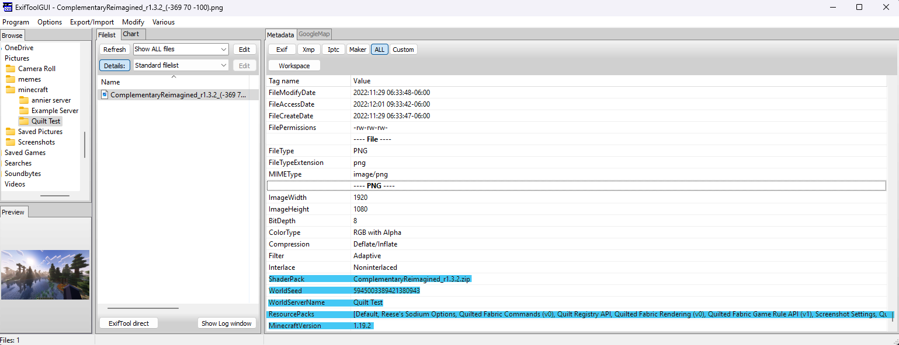

# Screenshot Settings

ScreenshotSettings is a mod for Quilt/Fabric that allows you to configure
various things about in-game screenshots.

"Various Things" includes choosing where screenshots are saved to on-disk, as well as how you'd like them to be named.
Relevant information to a screenshot can be optionally embedded into the filename or metadata, such as player position,
rotation, active texture or shader packs, the name of the world or server the screenshot was taken on, and if on
singleplayer, the world seed.

This should allow for convenient sorting/searching through screenshots by relevant metadata, and is also nice just for
making your screenshots more accessible. (Seriously, I hate having to go into my AppData folder when I'm playing on
Windows. It's terribly annoying.)

The mod also adds a new command:
```
/screenshot <optional-filename>
``` 

and an alias that does the same thing:
```
/ss <optional-filename>
```

If you use these commands and provide a filename, they will not follow the naming scheme you may have set, 
and they do not work with templates.
(This means you can't do something like `/ss <world>/cool_screenshot_name`)!


## Things you can do with the custom File Naming system.
The file naming system is somewhat bare bones at the moment, only supporting 8 templates.

- `<datetime>`
  - Minecraft's default screenshot naming format.
- `<world>`
  - The name of the world in Single Player, and the name of the server in Multiplayer.
- `<version>`
  - The version of Minecraft the screenshot was taken on. (Ex. 1.19.2)
- `<x>`, `<y>`, and `<z>`
  - The respective coordinates of where the screenshot was taken.
- `<shader>`
  - The active Shader pack. (requires Iris Shaders)
- `<player>`
  - Your Minecraft username. Useful for if you want to put screenshots from multiple accounts in the same place but keep them organized. (Not entirely sure why you would want to do that, but the point of this mod is to give you options, damnit!)
### Automatically Creating Subdirectories
By including a `/` in your naming scheme, you can create a directory structure based on the templates above.

You can automatically organize your screenshots into folders according to what world/server they were taken on, or what shaderpack was in use at the time of the screenshot.

The naming scheme I personally use is `<world>/<datetime>` because it makes it easier to go through my screenshots based on where I took them, and still prevents name collisions.

This results in a directory structure like the following

```
~/Pictures/minecraft
----------------------------------------------------------------
    ├── annier server
    │   ├── 2022-11-29_19.42.52.png
    │   ├── 2022-11-29_19.45.30.png
    │   ├── 2022-11-30_14.08.32.png
    │   ├── 2022-11-30_14.21.56.png
    │   ├── 2022-11-30_17.11.26.png
    │   ├── 2022-11-30_21.07.27.png
    │   ├── 2022-11-30_21.07.53.png
    │   ├── 2022-11-30_21.35.16.png
    │   ├── 2022-11-30_21.39.00.png
    │   ├── 2022-11-30_21.39.20.png
    │   ├── 2022-11-30_21.46.19.png
    │   └── 2022-11-30_23.42.15.png
    ├── Example Server
    │   ├── 2022-11-28_19.42.15.png
    │   └── 2022-11-28_19.30.06.png
    └── Quilt Test
        └── 2022-11-28_18.36.38.png
```
If you, however, were to have many servers saved as "Minecraft Server" and many singleplayer worlds named "New World", this wouldn't do much to help you.


## A note on PNG Metadata
The Windows Explorer cannot display the metadata included by this mod. You will need to get a dedicated program for windows to be able to see it.

### Viewing Metadata: CLI
If you're comfortable using a command-line tool, you can use [ImageMagick](https://imagemagick.org/)'s `identify --verbose` command to see it.

ImageMagick has releases for Windows, Mac, and Linux, and if you're on Linux chances are you already have it installed anyway.

This is the way I'd recommend, because it allows you to set up scripts for searching through or organizing your screenshots, but if all you're interested in is *viewing* metadata, perhaps you'd be more interested in a GUI.

#### This actually works with WSL.
Because Minecraft uses URIs to resolve file paths on Windows, you can actually use the path to an installed WSL distribution as a valid save location to make manipulating your screenshot collection via WSL more convenient.


### Viewing Metadata: GUI
If you *aren't* comfortable using a command-line tool... the best way I've found (on Windows, at least) is [exiftoolgui](https://exiftool.org/gui/).



It requires that you have the base [exiftool](https://exiftool.org) installed, but the "default" installation process for it isn't very user-friendly.
For installing the base tool, I recommend Oliver Betz's [exiftool for windows](https://oliverbetz.de/pages/Artikel/ExifTool-for-Windows). 
It comes packaged with a GUI installer and is just generally more convenient.

Once installed, you'll want to navigate to your screenshot and view the `All` tab to see all of its metadata. 
The metadata attached by this mod should appear at the bottom, as it does in the screenshot above.